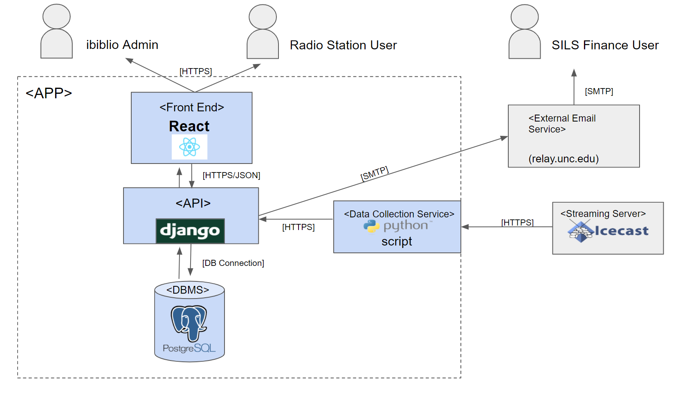

# ibiblio Radiostats 

## Summary 

ibiblio hosts online streams for radio stations. Our task is to develop a web app that will automate the retrieval of bandwidth and cost data. The web app should show monthly costs and grant permissions to manage/view the data based on user (ibiblio admin, station staff, SILS finance).

Getting Started
===

## Prerequisites:
<br>

- [Python 3.X](https://www.python.org/downloads/)
- [Node.js](https://nodejs.org/en/download/)

Installing: 
===
how can a user get a working development environment? Give step-by-step instructions.

## 1. Setup Python VirtualEnv  
__Windows__
```powershell 
cd \path\to\repository-root
Set-ExecutionPolicy RemoteSigned  *may not be necessary
python -m virtualenv . 
.\Scripts\activate
pip install -r requirements.txt
```

__Mac/Linux__ 
```sh 
cd /path/to/repository-root
virtualenv .
source bin/activate
pip install -r requirements.txt
```

 __virtualenv__ 

## 2 a.) Run Backend
__Windows__
```powershell 
cd \path\to\repository-root
.\Scripts\activate
copy-item config.dev.yml config.yml 
cd .\backend\
python manage.py runserver 
```
__Mac/Linux__
```sh
cd \path\to\repository-root
source bin/activate
cp config.dev.yml config.yml 
cd ./backend
python manage.py runserver
```
__Warranty:__ 

>Last Test: 11/10/2020 <br>
Tested by: Caleb Xu <br>
System: Mac OS 

>Last Test: 11/10/2020 <br>
Tested by: Zachary Guan <br>
System: Windows 10 

## 2 b.) Frontend

__Windows__
```powershell 
cd \path\to\repository-root
cd .\frontend
npm install
npm run start
```
__Mac/Linux__
```sh
cd /path/to/repository-root
cd ./frontend
npm install 
npm run start
```

__Warranty:__ 

>Last Test: 11/10/2020 <br>
Tested by: Caleb Xu <br>
System: Mac OS 

Testing
=== 
The following commands below will run the test suite. In addition, any push/pull request to github will automatically run the test suite and generate a coverage report. This was implemented through Github Actions. 


## Backend Test Suite

__Windows Test__
```powershell 
cd \path\to\repository-root
.\Scripts\activate
cd .\backend
python manage.py test
```
__Windows Test Coverage__
```powershell
cd \path\to\repository-root
.\Scripts\activate
cd .\backend
coverage run --source='.' .\manage.py test backend.usage backend.users
coverage html 
```
__Mac/Linux Test__
```sh
cd /path/to/backend/
source bin/activate
python manage.py test 
```
__Mac/Linux Test Coverage__

```sh 
cd /path/to/repository-root
source bin/activate
cd .\backend
coverage run --source='.' .\manage.py test backend.usage backend.users
coverage html 
```

## Frontend Test Suite

__Windows Test__
```powershell
cd \path\to\frontend\
npm run test -- --watchAll=false
```

__Windows Test Coverage__
```powershell
cd \path\to\frontend\
npm test -- --coverage --watchAll=false
```


__Mac/Linux Test__ 
```sh
cd /path/to/frontend/
npm test -- --watchAll=false
```

__Mac/Linux Test__
```sh
cd /path/to/frontend/
npm test -- --coverage --watchAll=false
```

How can the user run the test suite? Give specific commands.
Any other test-related commands to know about, e.g. a different command for unit tests vs. integration tests?

Deployment
===
- The current production environment lives in a VM hosted by ibiblio.

- We currently have a locally hosted pre-production environment we use but after our work on the project, we will shut it down. 

- Our project is currently CI/CD enabled through Github Actions


Technologies Used
===



- Django
- Docker 
- Python
- React 
- PostgreSQL
- Github Actions

The ADR is a pdf at the root of the repository. 

Contributing
===
- To contribute to this repository, contact ibiblio staff to gain access to this repository. 

- There are currently no conventions in place for the project 

- To find out more about this project, refer to our website, [ibiblio_radiostats](https://tarheels.live/ibibliobillingportal/)

Authors
===
### Zachary Guan
> Django Backend App Development 
### Caleb Xu 
> Deployment/Django Backend App Development 
### Jonathan Chang
> React Frontend Development

License
===

### MIT License

Copyright (c) [2020] [Zachary Guan, Caleb Xu, Jonathan Chang]

Permission is hereby granted, free of charge, to any person obtaining a copy of this software and associated documentation files (the "Software"), to deal in the Software without restriction, including without limitation the rights to use, copy, modify, merge, publish, distribute, sublicense, and/or sell copies of the Software, and to permit persons to whom the Software is furnished to do so, subject to the following conditions:

The above copyright notice and this permission notice shall be included in all
copies or substantial portions of the Software.

THE SOFTWARE IS PROVIDED "AS IS", WITHOUT WARRANTY OF ANY KIND, EXPRESS OR
IMPLIED, INCLUDING BUT NOT LIMITED TO THE WARRANTIES OF MERCHANTABILITY,
FITNESS FOR A PARTICULAR PURPOSE AND NONINFRINGEMENT. IN NO EVENT SHALL THE
AUTHORS OR COPYRIGHT HOLDERS BE LIABLE FOR ANY CLAIM, DAMAGES OR OTHER
LIABILITY, WHETHER IN AN ACTION OF CONTRACT, TORT OR OTHERWISE, ARISING FROM,
OUT OF OR IN CONNECTION WITH THE SOFTWARE OR THE USE OR OTHER DEALINGS IN THE
SOFTWARE.

Acknowledgements
===
Special thanks to our mentor John Dinger and the assistance of our amazing team at ibiblio, Karen and Cristobal. 
