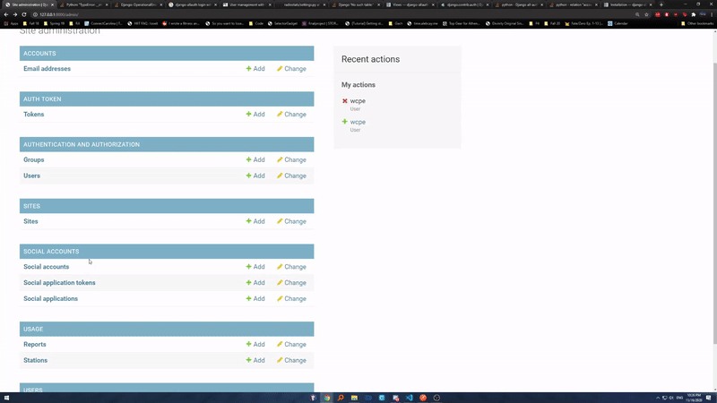
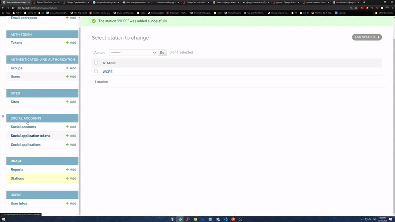
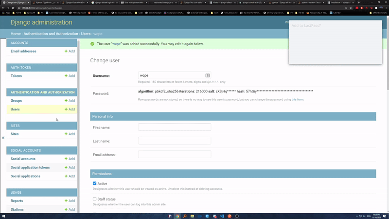

# ibiblio Radiostats

ibiblio hosts online streams for radio stations. Our task is to develop a web app that will automate the retrieval of bandwidth and cost data. The web app should show monthly costs and grant permissions to manage/view the data based on user (ibiblio admin, station staff, SILS finance).

Getting Started
===

## Prerequisites:
<br>

- [Python 3.X](https://www.python.org/downloads/)
- [Node.js](https://nodejs.org/en/download/)

Installing:
===

## 1. Setup Python VirtualEnv
__Windows__
```powershell
cd \path\to\repository-root
Set-ExecutionPolicy RemoteSigned  *may not be necessary
python -m virtualenv .
.\Scripts\activate
pip install -r agent\requirements.txt
pip install -r backend\requirements.txt
```

__Mac/Linux__
```sh
cd /path/to/repository-root
virtualenv .
source bin/activate
pip install -r agent/requirements.txt
pip install -r backend/requirements.txt
```

## 2 a.) Run Backend Locally
__Windows__
```powershell
cd \path\to\repository-root
.\Scripts\activate
copy-item config.dev.yml config.yml
cd .\backend\
python manage.py runserver
```
__Mac/Linux__
```sh
cd /path/to/repository-root
source bin/activate
cp config.dev.yml config.yml
cd ./backend
python manage.py runserver
```

## 2 b.) Running Frontend Locally

__Windows__
```powershell
cd \path\to\repository-root
cd .\frontend
npm install
npm run start
```

## 3.) ibiblio Admin User creation

The steps below will highlight how to create radio station users in our application. the endpoint to get to admin page is:
https://___/backend/admin

1. Create the ibiblio admin superuser if one has not been created.

```powershell
cd \path\to\repository-root
.\Scripts\activate
cd .\backend
python .\manage.py createsuper
```
you will then be prompted to fill out the username, email, and password for the admin

2. Create Station if it does not exist in system



3. Create User Profile



3. Create UserInfo




__Mac/Linux__
```sh
cd /path/to/repository-root
cd ./frontend
npm install
npm run start
```

## 2 c.) Running Agent Locally
__Windows__
```powershell
cd \path\to\repository-root
.\Scripts\activate
copy-item config.dev.yml config.yml
cd .\agent\
python start.py
```
__Mac/Linux__
```sh
cd /path/to/repository-root
source bin/activate
cp config.dev.yml config.yml
cd ./agent
python start.py
```

__Warranty:__

>Last Test: 11/10/2020 <br>
Tested by: Caleb Xu <br>
System: Mac OS

>Last Test: 11/10/2020 <br>
Tested by: Zachary Guan <br>
System: Windows 10

>Last Test: 11/10/2020 <br>
Tested by: Jonathan Chang <br>
System: Windows 10

Testing
===
The following commands below will manually run the test suite however, any push/pull request to the GitHub repository will automatically run the test suite. This was implemented through Github Actions.


## Backend Test Suite

__Windows Test__
```powershell
cd \path\to\repository-root
.\Scripts\activate
cd .\backend
python manage.py test
```
__Windows Test Coverage__
```powershell
cd \path\to\repository-root
.\Scripts\activate
cd .\backend
coverage run --source='.' .\manage.py test backend.usage backend.users
coverage html
```
__Mac/Linux Test__
```sh
cd /path/to/backend/
source bin/activate
python manage.py test
```
__Mac/Linux Test Coverage__

```sh
cd /path/to/repository-root
source bin/activate
cd ./backend
coverage run --source='.' ./manage.py test backend.usage backend.users
coverage html
```

## Frontend Test Suite

__Windows Test__
```powershell
cd \path\to\frontend\
npm run test -- --watchAll=false
```

__Windows Test Coverage__
```powershell
cd \path\to\frontend\
npm test -- --coverage --watchAll=false
```

__Mac/Linux Test__
```sh
cd /path/to/frontend/
npm test -- --watchAll=false
```

__Mac/Linux Test__
```sh
cd /path/to/frontend/
npm test -- --coverage --watchAll=false
```

Deployment
===
- The current production environment lives in a VM hosted by ibiblio.

- We currently have a locally hosted pre-production environment we use but after our work on the project, we will shut it down.

- Our project is currently CI/CD enabled through Github Actions

## Building and running for deployment

As is the case, copy `config.dev.yml` to `config.yml` and adjust the values within it accordingly. OCI images for the frontend,
backend, and agent can then be built with:

```sh
docker build . -f deploy/agent/Dockerfile -t ibiblio/radiostats-agent
docker build . -f deploy/backend/Dockerfile -t ibiblio/radiostats-backend
docker build . -f deploy/frontend/Dockerfile -t ibiblio/radiostats-frontend
```

Containers from these images can then be spun up, with directory/file mounts as needed:

```sh
docker run -d /path/to/config.yml:/config.yml -v /path/to/mounts.yml:/mounts.yml ibiblio/radiostats-agent
docker run -d /path/to/config.yml:/config.yml ibiblio/radiostats-backend
docker run -d /path/to/config.yml:/config.yml ibiblio/radiostats-frontend
```

The process of running the containers could also be automated using a tool such as `docker-compose`, with a snippet along the lines of:
```yml
version: "3.8"

services:
  backend:
    build:
      context: .
      dockerfile: deploy/backend/Dockerfile
    volumes:
      - ./config.yml:/config.yml
    environment:
      - CONFIG_PATH=/config.yml
    restart: always
    ports:
      - 8000:8000
    depends_on:
      - db
  frontend:
    build:
      context: .
      dockerfile: deploy/frontend/Dockerfile
    volumes:
      - ./config.yml:/config.yml
      - ./deploy/frontend/site.template:/etc/nginx/conf.d/site.template
    restart: always
    ports:
      - 3000:3000
  agent:
    build:
      context: .
      dockerfile: deploy/agent/Dockerfile
    volumes:
      - ./config.yml:/config.yml
      - ./mounts.yml:/mounts.yml
      - ./agent-data:/data
    restart: always
  db:
    image: postgres:alpine
    restart: always
    volumes:
      - ./data:/var/lib/postgresql/data
    environment:
      - POSTGRES_DB=postgres
      - POSTGRES_USER=postgres
      - POSTGRES_PASSWORD=mypgpass
      - PGDATA=/var/lib/postgresql/data/pgdata
```

The configuration that would accompany such a setup would resemble:
```
---
frontend:
  host: my.hostname.com
  port: 80
  tls: false
backend:
  debug: false
  host: backend
  port: 8000
  path: '/backend/'
  tls: false
  secret_key: 'l^k&e20&r754)5zi^8%zbfus66j#ytz@%bu44(fos!&7zgbl1d'
  database:
    engine: 'postgresql'
    # Path is relative to BASE_DIR - see settings.py in backend
    name: 'postgres'
    user: 'postgres'
    password: 'mypgpass'
    host: 'db'
    port: 5432
agent:
  debug: true
  dev: true
  icecast:
    hostname: 'fake.icecast.example.org'
    port: 8000
    data_file: '/data/response.xml'
    stats_url: '/admin/stats'
    username: 'my_admin'
    password: 'super_secure_password'
    request_timeout: 5
  cache_ttl: 240
  data_dir: '/data'
  key: 'ih#{YxFGDk(yRtB9k%jj}gf72rfVR8Nouy4w3n?/geHz.c3num=cbP6V86B(XKDN'
```

Technologies Used
===


- Django
- Docker
- Python
- React
- PostgreSQL
- Github Actions

The ADR is a pdf at the root of the repository.

Contributing
===
- To contribute to this repository, contact ibiblio staff to gain access to this repository.

- There are currently no conventions in place for the project

- To find out more about this project, refer to our website, [ibiblio_radiostats](https://tarheels.live/ibibliobillingportal/)

Authors
===
### Zachary Guan
> Django Backend App Development
### Caleb Xu
> Deployment/Django Backend App Development
### Jonathan Chang
> React Frontend Development

License
===

### MIT License

Copyright (c) [2020] [Zachary Guan, Caleb Xu, Jonathan Chang]

Permission is hereby granted, free of charge, to any person obtaining a copy of this software and associated documentation files (the "Software"), to deal in the Software without restriction, including without limitation the rights to use, copy, modify, merge, publish, distribute, sublicense, and/or sell copies of the Software, and to permit persons to whom the Software is furnished to do so, subject to the following conditions:

The above copyright notice and this permission notice shall be included in all
copies or substantial portions of the Software.

THE SOFTWARE IS PROVIDED "AS IS", WITHOUT WARRANTY OF ANY KIND, EXPRESS OR
IMPLIED, INCLUDING BUT NOT LIMITED TO THE WARRANTIES OF MERCHANTABILITY,
FITNESS FOR A PARTICULAR PURPOSE AND NONINFRINGEMENT. IN NO EVENT SHALL THE
AUTHORS OR COPYRIGHT HOLDERS BE LIABLE FOR ANY CLAIM, DAMAGES OR OTHER
LIABILITY, WHETHER IN AN ACTION OF CONTRACT, TORT OR OTHERWISE, ARISING FROM,
OUT OF OR IN CONNECTION WITH THE SOFTWARE OR THE USE OR OTHER DEALINGS IN THE
SOFTWARE.

Acknowledgements
===
Special thanks to our mentor John Dinger, our instructor Jeff Terrell, and our amazing clients at ibiblio, Karen and Cristobal.
